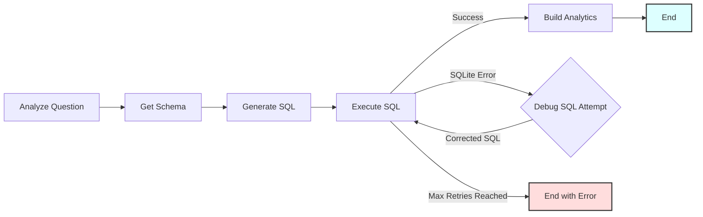

# Text-to-SQL Workflow

A PocketFlow example demonstrating a text-to-SQL workflow that converts natural language questions into executable SQL queries for an SQLite database, including an LLM-powered debugging loop for failed queries.

- Check out the [Substack Post Tutorial](https://zacharyhuang.substack.com/p/text-to-sql-from-scratch-tutorial) for more!

## Features

-   **Intent Analysis**: Classifies questions into SQL-generation, trend, peak-period, top-year, definition-lookup, and time-filtered aggregate intents.
-   **Schema Awareness**: Automatically retrieves the database schema to provide context to the LLM.
-   **Hybrid Retrieval Strategy**: Uses deterministic DHIS2 query templates for higher-reliability analytical questions and falls back to the local SQL model for general text-to-SQL prompts.
-   **LLM-Powered SQL Generation**: Uses the local GGUF model through `llama-cpp-python` to translate natural language questions into SQLite queries (using YAML structured output).
-   **Automated Debugging Loop**: If SQL execution fails, an LLM attempts to correct the query based on the error message. This process repeats up to a configurable number of times.
-   **Analytics Handoff**: Produces a structured analytics payload and a text analytics context string that a future answer model can consume directly.
## Getting Started

1.  **Install Packages:**
    ```bash
    pip install -r requirements.txt
    ```

2.  **Model and Dataset:**
    This project now defaults to the local files already included in the repo root:
    - `uliza_q4_k_m.gguf`
    - `dhis2.sqlite`

    You can override the model path if needed:
    ```bash
    export LLM_MODEL_PATH="/path/to/another-model.gguf"
    ```

3.  **Verify the Local Model (Optional):**
    Run a quick check using the utility script. If successful, it will print a short joke.
    ```bash
    python utils/call_llm.py
    ```

4.  **Run Default Example:**
    Execute the main script. This uses `dhis2.sqlite` by default and runs a DHIS2-friendly starter query.
    ```bash
    python main.py
    ```
    The default query is:
    > How many organisation units are there at each hierarchy level?

5.  **Run Custom Query:**
    Provide your own natural language query as command-line arguments after the script name.
    ```bash
    python main.py What is the total stock quantity for products in the 'Accessories' category?
    ```
    Or, for queries with spaces, ensure they are treated as a single argument by the shell if necessary (quotes might help depending on your shell):
    ```bash
    python main.py "List orders placed in the last 30 days with status 'shipped'"
    ```

## How It Works

The workflow uses several nodes connected in a sequence, with a loop for debugging failed SQL queries.



**Node Descriptions:**

1.  **`AnalyzeQuestion`**: Detects the query intent and extracts keywords and year filters.
2.  **`GetSchema`**: Connects to the SQLite database (`dhis2.sqlite` by default) and extracts the schema (table names and columns).
3.  **`GenerateSQL`**: Uses either deterministic DHIS2 SQL templates or the local LLM to generate an SQLite query.
4.  **`ExecuteSQL`**: Attempts to run the generated SQL against the database.
    *   If successful, the results are stored, and the flow ends successfully.
    *   If an `sqlite3.Error` occurs (e.g., syntax error), it captures the error message and triggers the debug loop.
5.  **`BuildAnalytics`**: Converts the executed SQL result into a structured analytics payload and text context for a future answer model.
6.  **`DebugSQL`**: If `ExecuteSQL` failed, this node takes the original query, schema, failed SQL, and error message, prompts the LLM to generate a *corrected* SQL query (again, expecting YAML).
7.  **(Loop)**: The corrected SQL from `DebugSQL` is passed back to `ExecuteSQL` for another attempt.
8.  **(End Conditions)**: The loop continues until `ExecuteSQL` succeeds or the maximum number of debug attempts (default: 3) is reached.

## Files

-   [`main.py`](./main.py): Main entry point to run the workflow. Handles command-line arguments for the query.
-   [`flow.py`](./flow.py): Defines the PocketFlow `Flow` connecting the different nodes, including the debug loop logic.
-   [`nodes.py`](./nodes.py): Contains the `Node` classes for intent analysis, SQL generation, execution, analytics packaging, and debugging.
-   [`utils/call_llm.py`](./utils/call_llm.py): Loads the local GGUF model and runs prompt inference.
-   [`utils/analytics.py`](./utils/analytics.py): Builds the structured analytics payload and downstream-model context.
-   [`populate_db.py`](./populate_db.py): Optional script to create and populate the sample `ecommerce.db` SQLite database.
-   [`requirements.txt`](./requirements.txt): Lists Python package dependencies.
-   [`README.md`](./README.md): This file.

## Example Output (Successful Run)

```
=== Starting Text-to-SQL Workflow ===
Query: 'total products per category'
Database: dhis2.sqlite
Max Debug Retries on SQL Error: 3
=============================================

===== DB SCHEMA =====

Table: customers
  - customer_id (INTEGER)
  - first_name (TEXT)
  - last_name (TEXT)
  - email (TEXT)
  - registration_date (DATE)
  - city (TEXT)
  - country (TEXT)

Table: sqlite_sequence
  - name ()
  - seq ()

Table: products
  - product_id (INTEGER)
  - name (TEXT)
  - description (TEXT)
  - category (TEXT)
  - price (REAL)
  - stock_quantity (INTEGER)

Table: orders
  - order_id (INTEGER)
  - customer_id (INTEGER)
  - order_date (TIMESTAMP)
  - status (TEXT)
  - total_amount (REAL)
  - shipping_address (TEXT)

Table: order_items
  - order_item_id (INTEGER)
  - order_id (INTEGER)
  - product_id (INTEGER)
  - quantity (INTEGER)
  - price_per_unit (REAL)

=====================


===== GENERATED SQL (Attempt 1) =====

SELECT category, COUNT(*) AS total_products
FROM products
GROUP BY category

====================================

SQL executed in 0.000 seconds.

===== SQL EXECUTION SUCCESS =====

category | total_products
-------------------------
Accessories | 3
Apparel | 1
Electronics | 3
Home Goods | 2
Sports | 1

=== Workflow Completed Successfully ===
====================================
```
